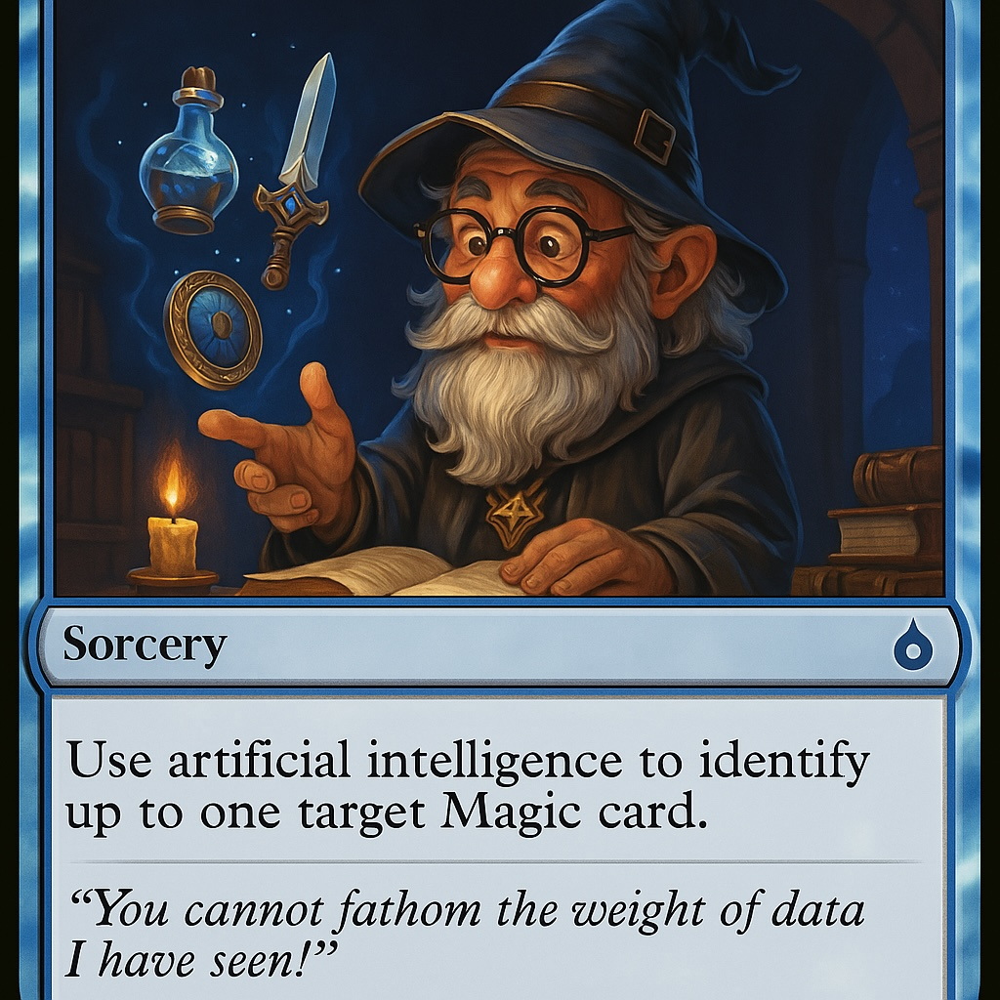
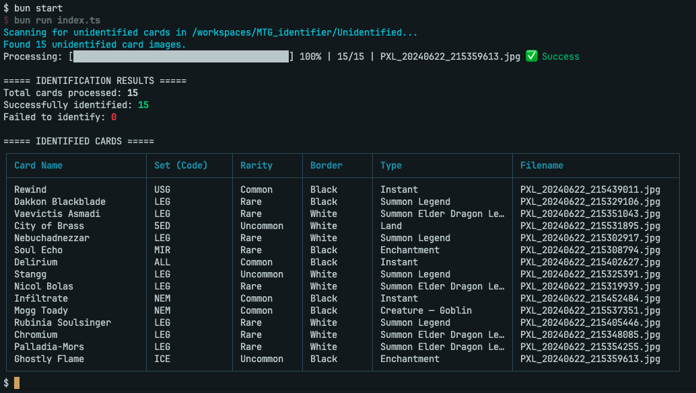

# MTG Identifier

<p align="center">
    
</p>

**MTG Identifier** is a user-friendly TypeScript application that uses advanced AI vision technology (Gemini Vision API) to easily identify Magic: The Gathering (MTG) cards from your images.

---

## 📖 About This Project

Magic: The Gathering cards contain detailed information that's critical for players, collectors, and enthusiasts alike. This tool simplifies card identification by automatically processing images and extracting key details such as card names, set codes, artist names, rarities, and much more.

Whether you're cataloging your collection or quickly checking the details of unknown cards, MTG Identifier streamlines the task using cutting-edge AI capabilities.

---

## 🖥️ Example Output

<p align="center">
    
</p>

---

## 🌟 Features

- Automatically processes images placed in the `Unidentified` folder
- Identifies Magic: The Gathering cards using Gemini Vision AI
- Extracts comprehensive structured card information, including:
  - Card Name, Set Code, and Border Color
  - Card Type, Rarity, and Artist
  - Mana Cost and Power/Toughness (where applicable)
- Presents information clearly in easy-to-read tables
- Real-time processing progress with visual indicators
- Robust retry logic to handle rate limit issues seamlessly

---

## 🚀 Quick Setup

Follow these easy steps to get the application running:

### Option 1: Local Setup

#### Step 1: Clone the repository

```bash
git clone https://github.com/amscotti/MTG_identifier.git
cd MTG_identifier
```

#### Step 2: Install Dependencies

```bash
bun install
```

#### Step 3: Configure API keys

- Copy and configure the environment file:

```bash
cp .env.example .env
```
- Open `.env` and insert your Gemini API key (get it from [Google AI Studio](https://ai.google.dev/))

#### Step 4: Place Images

- Move your MTG card images into the `Unidentified` folder.

#### Step 5: Run the Application

```bash
bun run index.ts
```

### Option 2: Using DevContainer (Recommended)

#### Prerequisites:
- Visual Studio Code with [Remote - Containers](https://marketplace.visualstudio.com/items?itemName=ms-vscode-remote.remote-containers) extension
- Docker Desktop installed and running

#### Step 1: Clone the repository

```bash
git clone https://github.com/amscotti/MTG_identifier.git
cd MTG_identifier
```

#### Step 2: Open in VS Code and Start Container

```bash
code .
```

When prompted, click "Reopen in Container" or use the command palette (F1) and select "Remote-Containers: Reopen in Container"

#### Step 3: Configure API keys

- Copy and configure the environment file inside the container:

```bash
cp .env.example .env
```
- Open `.env` and insert your Gemini API key

#### Step 4: Place Images and Run

- Move your MTG card images into the `Unidentified` folder
- Run the application:

```bash
bun run index.ts
```

The DevContainer automatically sets up all dependencies and provides a consistent development environment.

---

## 🛠️ Technical Overview

This project uses modern technologies, including:

- **TypeScript** (strict mode enabled for reliability)
- **Bun Runtime** (for optimal performance and efficiency)
- **Google Gemini API** (advanced vision processing)
- **Zod** (robust data validation)
- **Biome.js** (code quality with linting and formatting)
- **DevContainers** (consistent development environments)

### Helpful Commands

- **Run Application**: `bun run index.ts`
- **Type Checking**: `bun x tsc --noEmit`
- **Linting**: `bun lint`
- **Formatting**: `bun format`
- **Check (Lint & Format)**: `bun check`

---

## 📌 Current Status

The application currently supports:

- Multi-card processing with robust retry logic
- Accurate identification of various card types, including older editions
- Real-time progress visualization

---

## 🔮 What's Next?

Planned enhancements include:

- Batch image processing for greater speed
- Validation against the Scryfall API for accuracy
- Enhanced storage solutions for organized card management
- Improved accuracy for challenging card identifications

---

## 🎴 Magic: The Gathering Card Anatomy

Understanding these elements can enhance your use of MTG Identifier:

1. **Card Name** – Top-center text identifying the card.
2. **Mana Cost** – Symbols located in the top-right corner.
3. **Type Line** – Indicates card categories (Creature, Instant, Sorcery).
4. **Border Color** – Black for original printings, white for reprints.
5. **Rarity Indicator** – Color-coded symbols (gold for rare, silver for uncommon).
6. **Artist Name** – Bottom of the illustration area.
7. **Set Code** – Three-letter code indicating the card set (e.g., "LEG", "USG").
8. **Power/Toughness** – Bottom-right corner (creature cards only).

---

Enjoy quickly and easily managing your MTG cards with **MTG Identifier**!
